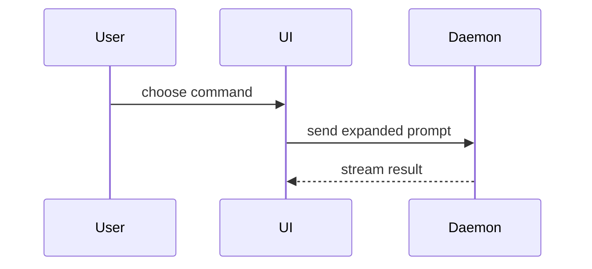

# Open PR

Push the branch and open its PR with `Closes #<n>` in the body. `verify` finds the Issue, and through it the spec, from that line, so every PR this skill opens carries it.

Before the first GitHub call, read `${CLAUDE_PLUGIN_ROOT}/reference/github.md` and `${CLAUDE_PLUGIN_ROOT}/reference/workflow.md`. The body template's origin is in [CREDITS.md](CREDITS.md).

## 1. Find the Issue

Use the Issue the user or `implement` named, or the one the conversation or the branch name points to. If there is none, follow **No Issue yet** in `workflow.md`: without an Issue, `verify` has no spec to judge against. Before it adds the first label to the new Issue, run `node ${CLAUDE_PLUGIN_ROOT}/scripts/trust.mjs` in the repo's checkout and use the label names in its `config.labels`: a repo can rename them (see **Configuration** in `workflow.md`).

## 2. Check the branch and push

The branch is the one given by name, by the user or by `implement`. With no branch named, use the current branch, resolved to its name with `git branch --show-current` first.

- It is not the default branch.
- It has commits that the default branch does not have.
- If it is checked out, the working tree is clean, or the user agrees to leave the uncommitted changes out.

Look up the branch's open PR (see `github.md`). Then decide whether to ask before pushing:

- **The branch has an open PR:** push without asking. Nothing new is published, and the PR stays a draft until a person marks it ready.
- **The user asked for it in this conversation:** they ran `/macro-loop:open-pr`, or said "push" or "open a PR". Push without asking. Being called by `implement` or `next` is not the user asking.
- **Otherwise:** ask once, naming the branch, the remote (`origin`) and the base: "Push `<branch>` to `origin` and open a draft PR against `<base>`?" On no, push nothing and open no PR; when `implement` called this skill, it continues with `verify` on the local branch.
- **Nobody can answer** (you run as a subagent or in a Workflow run): do not push. Say that the branch was not pushed and no PR was opened.

Push in a shell call of its own, with nothing that could hide its exit code (no pipe, no `;`, no `||`): `git push -u origin <branch>`. If the push fails, stop: report the error and send no PR request.

## 3. Reuse an open PR

If the branch already has an open PR, the push has updated it. Check that its body still has `Closes #<n>`; if not, tell the user, since `verify` needs that line. Report the PR's URL and skip steps 4 and 5. When `implement` called this skill, it continues with `verify`.

## 4. Write the body

Start the body with `Closes #<n>` on its own line, then fill in the template below from the diff against the base branch (`git diff origin/<base>...<branch>`) and the Issue's spec.

```markdown
Closes #<n>

## Summary

<diagram, diff-sketch, or tree>

## Evidence

- **Before:** <screenshot/output/failing test run>
  **After:** <screenshot/output/passing test run>

## Merge Danger

**Door:** <one-way or two-way>

<optional: description>

**Blast Radius:** <one-word description>

<optional: potential ramifications of merge>
```

Skip all preambles and keep prose brief. Use the domain language of the repo's glossary, if it has one.

### Summary

Pick the smallest view that makes the key point clear.

- Show logic or an algorithm as pseudocode:

```text
on(save)
  if content is unchanged
    return cached result
  write new content
  return fresh result
```

- Show runtime control flow as a call tree:

```text
submitForm
  createSession
    persistPrompt
    launchAgent
  navigateToSession
```

- Show UI structure as a component tree, including state and module boundaries that matter:

```text
<SessionPage> (apps/example/src/routes/session.tsx)
  useSessionEvents()
  <SessionToolbar>
    <RunSkillButton> (packages/ui)
```

- Show file responsibility or a broad refactor as a shallow file tree:

```text
src/
├── commands/       # parses user actions
├── sessions/       # owns session state
└── transport/      # sends API requests
```

- Show component interaction, control flow, or data flow with Mermaid:



- Use `diff` when the point is what changes and the surrounding shape already exists. Match the diff shape to the topic.

For a component change:

```diff
 <SessionPage>
   useSessionEvents()
   <SessionToolbar>
+    <RunSkillButton />
   <SessionTimeline>
+    <SkillResultCard />
```

For a file-layout change:

```diff
 src/
 ├── commands/
+│   └── show-me.ts       # expands the slash command
 ├── sessions/
-└── transport.ts
+└── transport/
+    ├── client.ts
+    └── stream.ts
```

For a call-tree or call-stack change:

```diff
 submitForm
   createSession
     persistPrompt
+    expandSkillMention
     launchAgent
-  navigateToSession
+  navigateToSession
+    subscribeToEvents
```

For a state or control-flow change:

```diff
 on(save)
-  write content
+  if content is unchanged
+    return cached result
+  write new content
+  invalidate cache
```

- Show the whole block when most of it is new, when omitted context would hide ownership or order, or when the reader needs a copyable target shape:

```ts
function expandSkill(command: string): string {
  const skillName = command.slice(1);
  return `use the ${skillName} skill`;
}
```

Place each visual next to the short text it supports. Keep only the calls, files, props, states, and boundaries the reviewer needs to understand the change. Use one view, or several; it is unlikely you will need all of them.

### Evidence

Concrete evidence that the change works. Show a before and after.

Screenshots are S-tier, when the environment is set up for it and the change is visual.

Execution-based evidence is A-tier: test results, console output. Show the exact test that now fails and passes, using pseudocode.

### Merge Danger

Say whether it is a one-way or two-way door. You can walk back through two-way doors, but not one-way doors. A PR that is cheap to roll back is lower risk. Changes that involve destructive actions or hard-to-reverse decisions are one-way doors.

The blast radius is the potential impact or scope of the changes introduced by this PR. Consider all possibilities: layout shift, breakage for consumers, mobile responsiveness, and so on.

## 5. Open the PR

- **Title:** what the change does, in the imperative, under 70 characters.
- **Base:** the default branch.

Create it as a draft with REST (see `github.md`): a draft cannot be merged until a person marks it "Ready for review", so nobody merges before `verify` has posted its verdict. Report its URL. The next step is `/macro-loop:verify`.

If GitHub answers 422 because the repo cannot hold a draft (as on a Free plan's private repo), ask before opening a ready PR, which can be merged at once. On yes, send the same request without `-F draft=true`. On no, open no PR; when `implement` called this skill, it continues with `verify` on the branch.

Never mark the draft ready yourself: that is the person's step, after reading the verdict.
